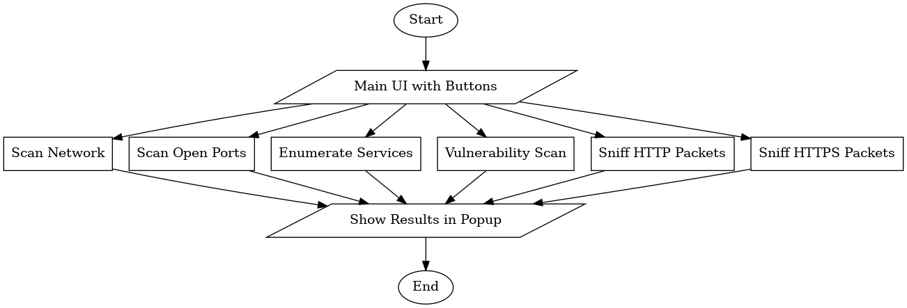
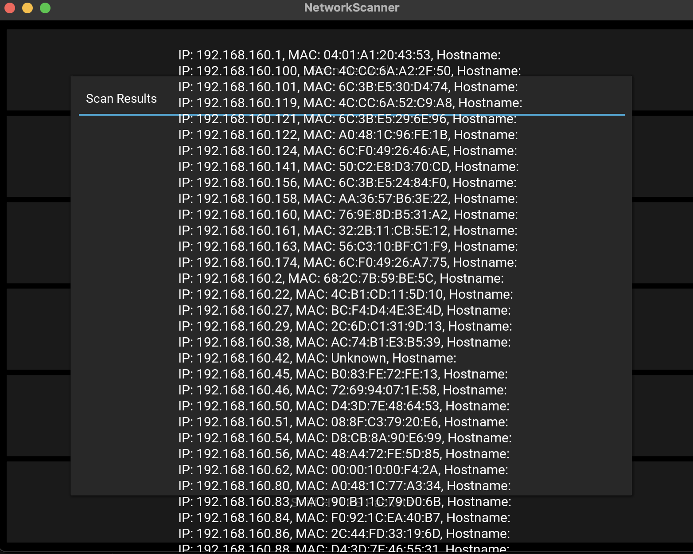

# Network Scanner

<!--  -->

## Overview
The **Network Scanner** is a cybersecurity tool developed to identify live hosts, detect open ports, and visualize network activity in real time. 
It includes both a graphical user interface (GUI) and a command-line interface (CLI) for flexible use during network assessments and penetration testing exercises.

## Features
- Host discovery and network scanning
- Port scanning with configurable ranges
- Real-time scanning visualization (GUI)
- CLI-based scanning for lightweight environments
- Reporting and screenshots for documentation
- Modular Python-based structure for easy expansion

## Technologies Used
- **Python 3**
- **Kivy** – for GUI interface
- **Scapy** – for packet crafting and scanning
- **Python-Nmap** – for detailed port enumeration
- **Socket Programming**
- **Virtual Environment (venv)**

## Architecture
The tool is designed with a modular approach separating GUI, scanning logic, and utility functions.
The architecture diagram below represents the overall workflow of the system.



## Installation
Clone the repository and set up the virtual environment:

```bash
git clone https://github.com/<your-username>/Network-Scanner.git
cd Network-Scanner
chmod +x run.sh
./run.sh gui
```

Or manually:
```bash
python3 -m venv .venv
source .venv/bin/activate
pip install -r requirements.txt
```

## Usage

### GUI Mode
Launch the interactive GUI version (recommended for visualization):

```bash
./run.sh gui
```

### CLI Mode
Run a quick port scan directly from the terminal:

```bash
./run.sh cli
```
or
```bash
python3 src/cli_main.py --host 192.168.1.1 --ports 22,80,443
```

## Project Structure
```
Network-Scanner/
├── README.md
├── requirements.txt
├── run.sh
├── src/
│   ├── scanner.py
│   ├── cli_main.py
│   ├── advanced_scan.py
│   └── ...
├── outputs/
│   └── screenshots/
│       └── network_scanner_workflow.png
└── docs/
    ├── main.tex
    └── network_tool_log.txt
```

## Example Output
Example results and screenshots are located in the `outputs/screenshots/` directory.

```markdown


```


## Reports and Logs
Detailed project documentation and execution logs are available for review:

- **[Project Report (main.tex)](docs/main.tex)** — formal LaTeX report including objectives, methodology, and results.
- **[Execution Log (network_tool_log.txt)](docs/network_tool_log.txt)** — example scan output and network analysis results.

These documents provide deeper insight into the working of the Network Scanner and the research process behind its development.

## License
This project is licensed under the **MIT License** — you are free to use, modify, and distribute it.

## Author
**Saugat Chaudhary**  
Cybersecurity Enthusiast | Network Security & Ethical Hacking

---
*This project was created for educational and ethical cybersecurity research purposes only.*
